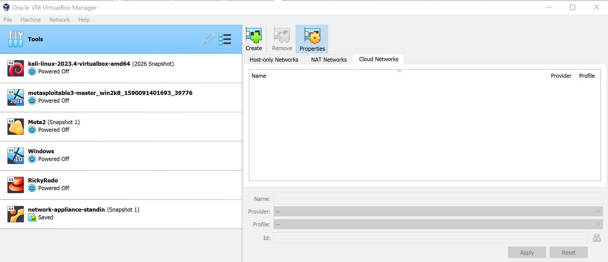

# Cybersecurity Home Lab — VM Installation & Troubleshooting

Built Feb 2024 as part of the NPower Advanced Cybersecurity program (the training 
that led to my CompTIA Security+ certification). The assignment: build a home lab 
from scratch to safely explore security tools, exploits, and defensive techniques 
without risking a host machine.

This was an individual project — each student built and configured their own lab 
environment.

## What I Built

- **Hypervisor**: Oracle VM VirtualBox
- **Host PC setup**: built and configured the host machine to support multiple 
  concurrent VMs
- **Virtual machines**:
  - Kali Linux — attacker/security-testing machine
  - Metasploitable 3 — deliberately vulnerable target for practicing exploitation
  - Meta2 — additional vulnerable lab target
  - Windows 10 — target/environment machine
  - RickyRedo — additional target VM
  - network-appliance-standin — simulated network appliance for networking/security exercises
- **Networking**: configured NAT/bridged networking so lab VMs could interact and 
  attack/defend each other in a sandboxed environment, without exposing the host 
  machine or my home network to risk

## How the Lab Is Used

Kali Linux serves as the attacking/investigation machine. From Kali, I connect to 
the isolated target VMs to practice a typical workflow: identify the target → 
enumerate its services → research vulnerabilities → exploit → gain a shell → 
investigate the compromised system → understand remediation.

## Troubleshooting & Learning

Getting VMs to talk to each other safely — without bridging them onto the live 
host network — was the core networking challenge. I worked through VirtualBox's 
NAT and bridged adapter modes to build an isolated sandbox where exploits could 
be run and observed end-to-end, without any risk to my own machine.

I also worked through VM resource allocation (CPU/memory/storage) to keep 
multiple VMs running smoothly at once on a single host.

## Ongoing Use

This lab didn't end with the assignment — I've continued building on the same 
environment for later cybersecurity coursework and self-directed learning.

## Notes

Built as coursework through NPower's Advanced Cybersecurity Program (CompTIA 
Security+ track).
